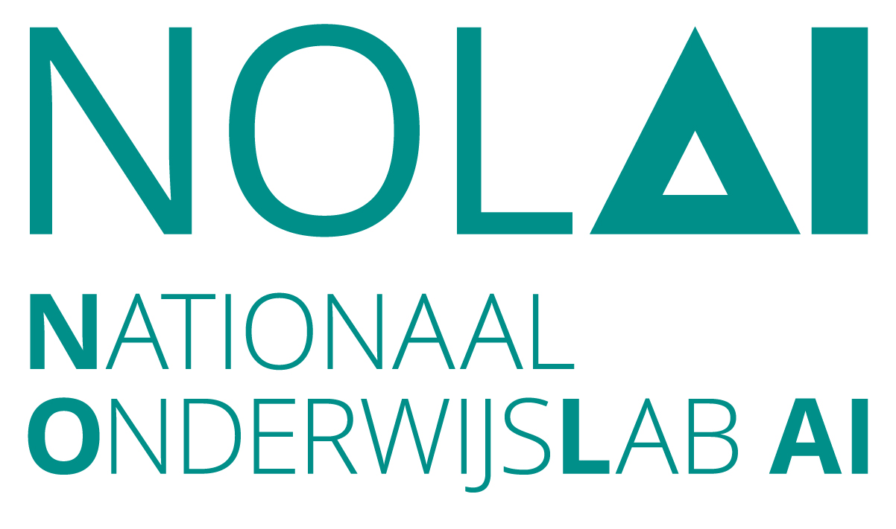

# Zelfregulatie

Dit is een NOLAI co-creatie project. Voor meer details over het co-creatie project, zie hier: https://www.ru.nl/onderzoek/onderzoeksprojecten/zelfregulatie-tijdens-het-schrijven

Deze repository is een bundeling van de onderliggende software. Deels is deze buiten het co-creatie project ontwikkeld en deels speciaal voor dit co-creatie project. Voor informatie zie de READMEs van deze projecten.

[De Flora backend](FLoRA/) bestond al voor het co-creatie project en is veel breder inzetbaar. De [srl (self regulated learning) API]([srl-api/](https://github.com/NOLAI/srl-api)) en het [srl Dashboard]([srl-dashboard/](https://github.com/NOLAI/srl-dashboard)) zijn voor dit project ontwikkeld.

## Benodigheden om zelf het project te reproduceren

Om het gehele project na te maken en de software te hergebruiken vraagt enige extra draaiende software:

- Een moodle omgeving, de plek waar leerlingen een schrijopdracht maken.
- Een (mysql) database, gebruikt door Moodle, de Flora backend en de srl API.
- Een redis instantie voor de Flora backend.
- Een elastic search instantie voor de Flora backend.
- Een kafka instantie voor de Flora backend.
- Een zookeeper instantie voor kafka.
- Een [T-Scan](https://github.com/CentreForDigitalHumanities/tscan) instantie voor de srl API.

Daarnaast is voor de srl API toegang nodig to [LIWC](https://www.liwc.app/), dit vereist een abbonement.

### Onderlinge koppeling

Tussen de verschillende services wordt de informatie voornamelijk via de database uitgewisseld. Voor de analyse pipeline uit de srl projecten is het nodig dat de door de Flora backend verzamelde data gelabeld wordt. Dit kan door een request als het volgende te maken:

```
curl 'https://<flora backend url>/myapi/data/label-model/request-labeling' \
  -X POST \
  -H 'Accept: application/json, text/plain, */*' \
  -H 'Content-Type: application/json' \
  -H 'Authorization: Bearer <moodle_token>' \
  --data-raw '{"userIDs":[<moodle_user_ids>],"dataItem":1,"courseIDs":[<moodle_course_ids>],"adminID":"<moodle_admin_name>"}'
```

## Configuratie

De meeste configuratie instructies staan in de sub-projecten zelf. Maar er zijn een aantal dingen die misschien niet meteen duidelijk zijn.

### Moodle configuratie

Voor de moodle configuratie is een de [Generico filter plugin](https://moodle.org/plugins/filter_generico) nodig. Deze wordt gebruikt om de [Flora javascript templates](FLoRA/src/main/resources/templates/generico_and_additional_config) op de opdracht pagina's in te laden zodat deze script het schrijfproces kunnen tracken.

### Flora backend configuratie

De configuratie van de Flora backend zit deels in de java code dit zit in [MyConstant.java](FLoRA/src/main/java/com/monash/flora_backend/constant/MyConstant.java) en [FLoRABackendApplication.java](FLoRA/src/main/java/com/monash/flora_backend/FLoRABackendApplication.java).

Voor het aanpassen van script functionaliteit kan ook [general_config_all_course.html](FLoRA/src/main/resources/templates/generico_and_additional_config/general_config_all_course.html) aangepast worden.

## Vragen

Voor vragen over de technische aspecten van het project neem vooral contact op met het [NOLAI tech team](mailto:nolai.tech@ru.nl).

## Gerelateerde publicaties

[Bistolfi, I., de Mooij, S., Sparou, C., Molenaar, I., & van der Graaf, J. (2026, July). Co-designing a Dashboard Promoting SRL for Secondary Education. In International Conference on Human-Computer Interaction (pp. 37-58). Cham: Springer Nature Switzerland.](https://doi.org/10.1007/978-3-032-30781-1_3)

[Bistolfi, I., de Mooij, S., van der Graaf, J., & Molenaar, I. (2025, July). Towards real-time automated self-regulated learning detection in essays. In International Conference on Artificial Intelligence in Education (pp. 377-392). Cham: Springer Nature Switzerland.](https://doi.org/10.1007/978-3-031-98420-4_27)

## Funding

Dit project is mede gefinancierd door het [Nationaal Onderwijslab AI](https://nolai.nl)


